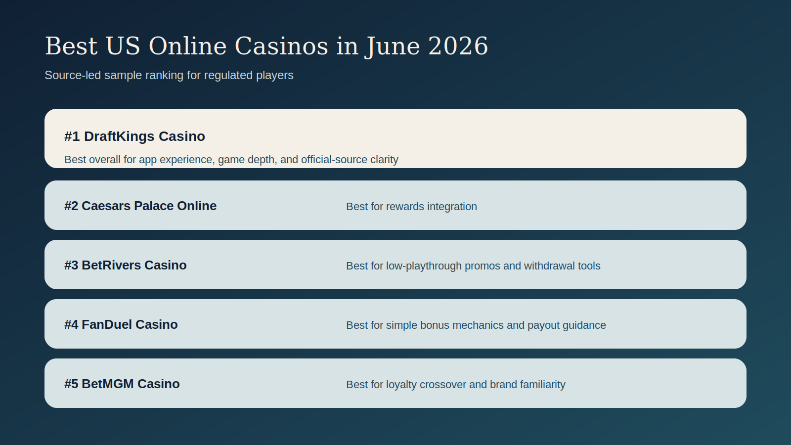
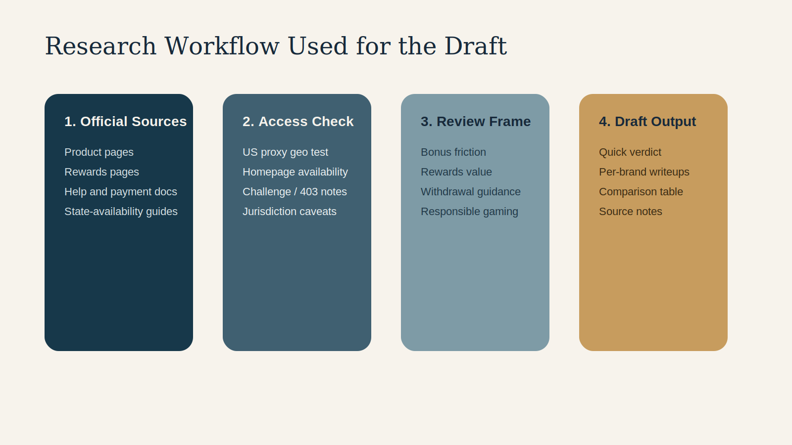
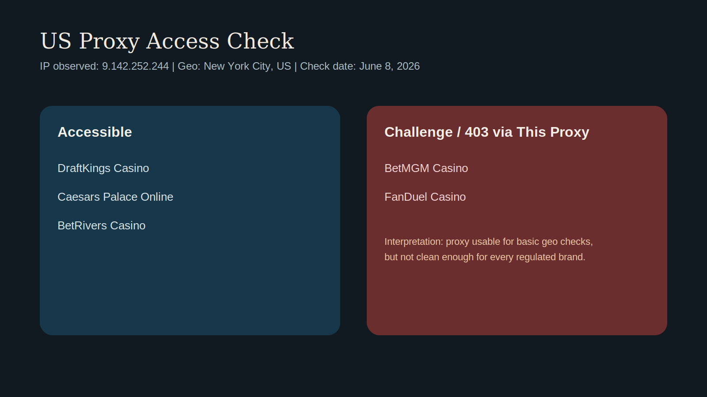

# Best US Online Casinos in June 2026: Our Top Picks for Regulated Players

> Editorial status: source-led sample draft  
> Last updated: June 8, 2026  
> Reviewer location for access checks: New York, US via static ISP proxy  
> Important limitation: this draft is based on official operator pages, product/help pages, and public company materials. Logged-in screenshots, cashier captures, and live support transcripts are still pending.

## Quick Verdict

For a regulated-US-only ranking, the strongest shortlist right now is:

1. **DraftKings Casino**: Best overall for app experience, exclusives, and broad game depth.
2. **Caesars Palace Online Casino**: Best for rewards integration and recognizable casino-brand ecosystem.
3. **BetRivers Casino**: Best for low-playthrough promos and player-facing withdrawal tools.
4. **FanDuel Casino**: Best for simple bonus mechanics and straightforward withdrawal guidance.
5. **BetMGM Casino**: Best for loyalty crossover and established multi-state presence.

## Why This List Is Narrow

This is intentionally a **regulated US online casino** list, not a global or crypto-casino roundup. Every pick here is framed around the regulated US market as of **June 8, 2026**.

Weak casino articles often mix:

- legal US operators
- offshore brands
- crypto-first casinos
- state-specific bonus pages

into one ranking without explaining the tradeoffs. This draft avoids that.

## Research Method Used

We reviewed current official operator pages and public materials with an editorial lens focused on:

- state availability
- rewards and retention features
- bonus usability
- withdrawal guidance
- payment visibility
- responsible gambling tools
- product depth and differentiation

## Proxy Access Check

We also ran basic access checks through a US proxy from New York on June 8, 2026.

- `DraftKings`: accessible
- `Caesars Palace Online`: accessible
- `BetRivers`: accessible
- `BetMGM`: homepage challenge / 403 via this proxy
- `FanDuel`: homepage challenge / 403 via this proxy

That does **not** prove those brands are unavailable to normal users. It only means this specific proxy was not clean enough to load every site consistently.

## Best US Online Casinos in June 2026

### 1. DraftKings Casino
**Best overall regulated US casino**

DraftKings earns the top spot in this sample because its official product positioning is the most complete and easiest to verify quickly. Its casino product page highlights `over 300 games`, live dealer options, and a set of DraftKings-exclusive titles.

What we like:

- Officially available in `Connecticut, Michigan, New Jersey, Pennsylvania, and West Virginia`
- Product page emphasizes a deep game catalog plus exclusives
- Live dealer is positioned as a core feature, not a side add-on
- 24/7 support is referenced in help content
- Accessible through the test proxy on June 8, 2026

What holds it back:

- Promo structures appear to rotate often, so broad claims about “best bonus” need current state-by-state verification
- The app can feel promotion-heavy if a player wants a simpler casino-only flow

### 2. Caesars Palace Online Casino
**Best for rewards and land-based crossover value**

Caesars Palace Online Casino stands out because its online experience is tightly tied to `Caesars Rewards`, which remains one of the clearest loyalty hooks among major US operators.

What we like:

- Caesars states its online casino platforms are available in `New Jersey, Pennsylvania, Michigan, West Virginia`, plus `Ontario` in Canada
- Recent company releases highlight exclusive game launches and rewards integration
- The platform connects online play to the broader Caesars ecosystem
- Accessible through the test proxy on June 8, 2026

What holds it back:

- Some of the strongest Caesars value propositions depend on how much you care about the wider Caesars ecosystem
- Promotional copy can be state-specific, so exact welcome-offer claims still need local verification

### 3. BetRivers Casino
**Best for low-playthrough promos and withdrawal tooling**

BetRivers looks unusually strong from a policy-and-usability perspective. Its official pages repeatedly emphasize `1x bonus playthrough`, a `Bonus Bank`, a `Bonus Store`, and `RUSHPAY`.

What we like:

- Repeated public emphasis on `1x` playthrough
- Bonus Bank and Bonus Store are clearly differentiated product features
- RUSHPAY is positioned as a player-facing withdrawal tool
- Accessible through the test proxy on June 8, 2026

What holds it back:

- Messaging varies by state, so market-specific pages need careful handling
- BetRivers has strong utility language, but weaker mainstream brand recognition than DraftKings or Caesars

### 4. FanDuel Casino
**Best for simple bonus mechanics and payout guidance**

FanDuel is one of the cleaner operators to review from a bonus-terms standpoint because its public guides explain deposits, withdrawals, and bonus mechanics in unusually plain language.

What we like:

- Officially available in `Michigan, Pennsylvania, New Jersey, West Virginia, and Connecticut`
- Public deposit and withdrawal instructions are unusually clear
- Public materials say bonus funds generally require only `1x` playthrough
- Responsible-gaming tools are easy to find

What holds it back:

- The homepage returned a `403` via this proxy, so direct access verification was incomplete in this setup
- Some current offers are campaign-based and can change quickly by month and state

### 5. BetMGM Casino
**Best for loyalty crossover and brand familiarity**

BetMGM remains a serious contender because of its rewards structure and brand familiarity, especially for players who already know MGM properties.

What we like:

- BetMGM publicly states casino play is available in `Michigan, New Jersey, Pennsylvania, and West Virginia`
- Rewards content remains a central differentiator
- Strong brand familiarity for mainstream US players

What holds it back:

- The site returned a challenge / `403` via this proxy during our access test
- Exact offer strength is heavily state-dependent

## Comparison Snapshot

| Casino | Best For | Official Availability Signal | Bonus / Rewards Angle | Access Check via NY Proxy |
| --- | --- | --- | --- | --- |
| DraftKings | Overall app and game depth | CT, MI, NJ, PA, WV | rotating promos, exclusives, rewards | Accessible |
| Caesars Palace Online | Rewards ecosystem | MI, NJ, PA, WV, ON | Caesars Rewards integration | Accessible |
| BetRivers | Bonus usability | state-specific regulated pages | 1x playthrough, Bonus Bank, RUSHPAY | Accessible |
| FanDuel | Simplicity and withdrawal guidance | MI, NJ, PA, WV, CT | 1x wagering, clear withdrawal flow | 403 via this proxy |
| BetMGM | Loyalty crossover | MI, NJ, PA, WV | BetMGM Rewards, state-specific bonuses | 403 via this proxy |

## Final Verdict

If this were being published today as a tightly scoped US page, the safest editorial order would be:

1. `DraftKings Casino`
2. `Caesars Palace Online Casino`
3. `BetRivers Casino`
4. `FanDuel Casino`
5. `BetMGM Casino`

This draft should still be upgraded with:

- logged-in screenshots
- payment-page captures
- live support transcripts
- state-by-state promo verification
- alt text and image captions for final publishing

## Sources

See [source-notes-best-us-online-casinos-june-2026.md](source-notes-best-us-online-casinos-june-2026.md).
