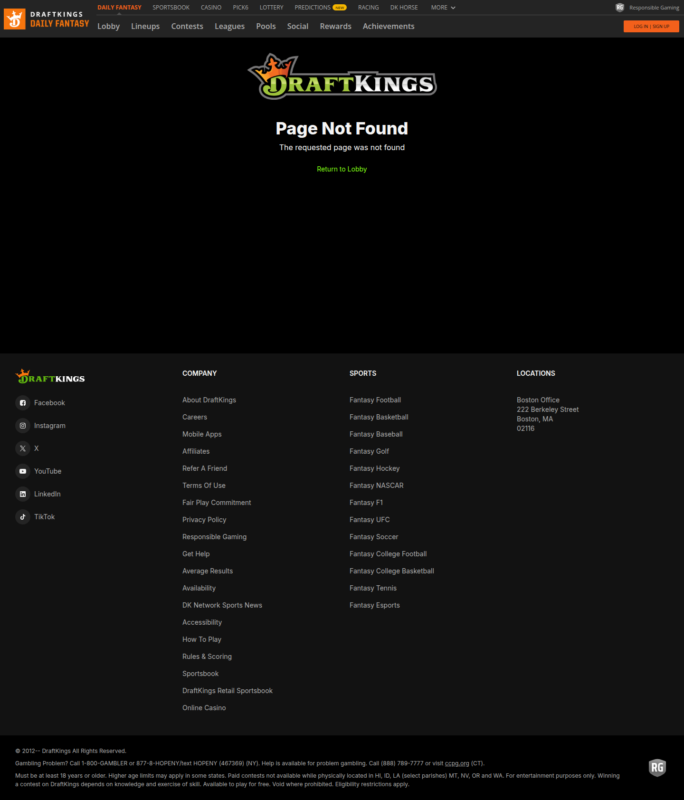
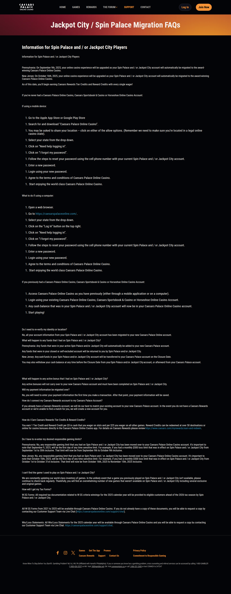
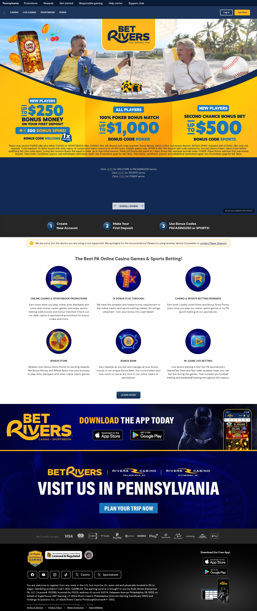
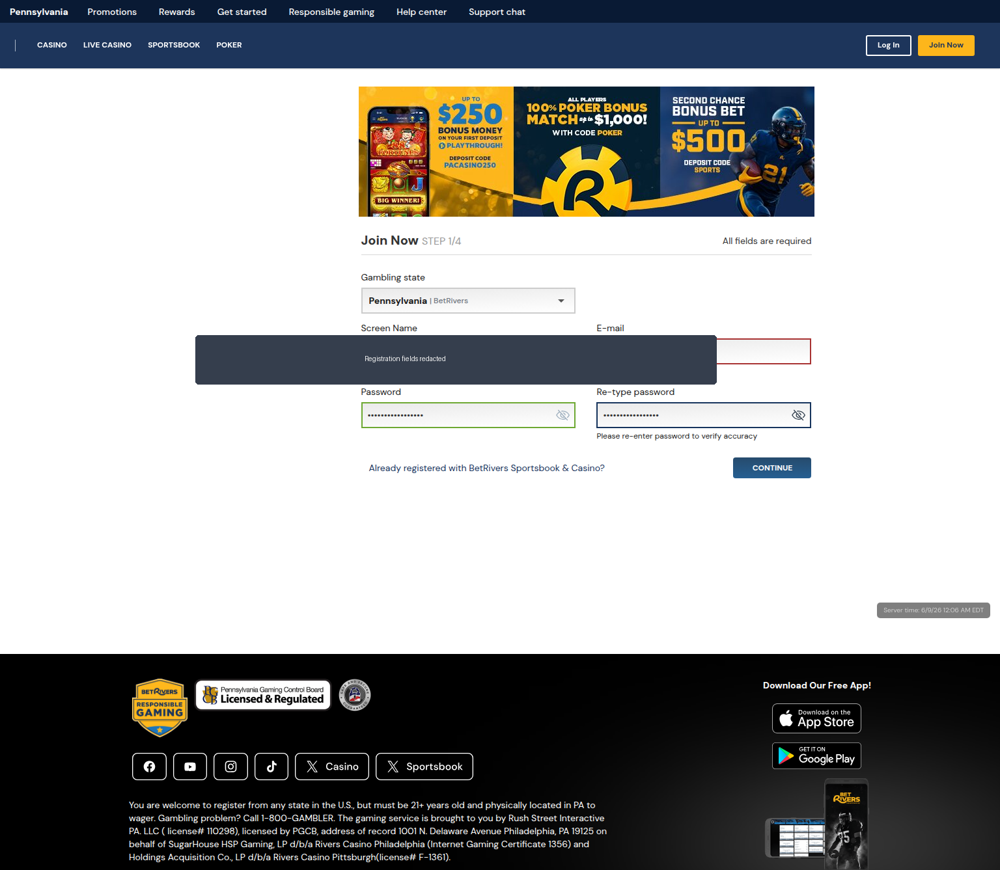
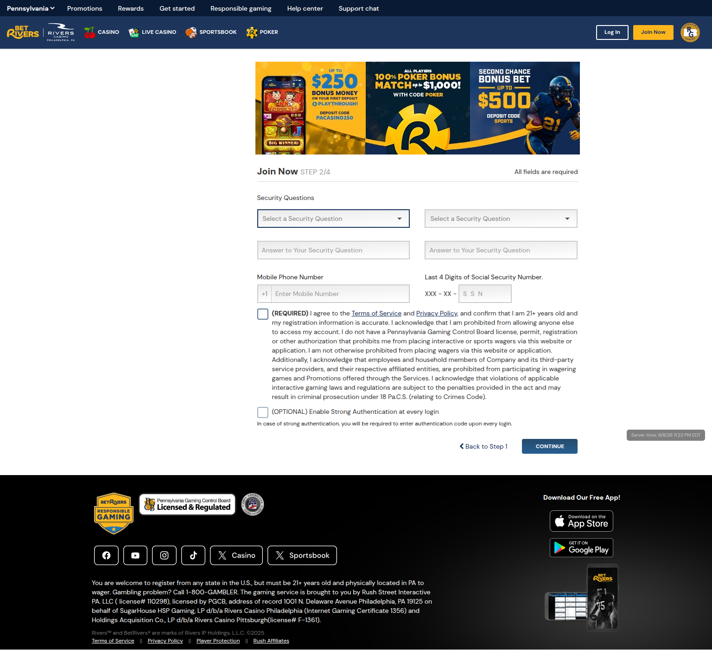
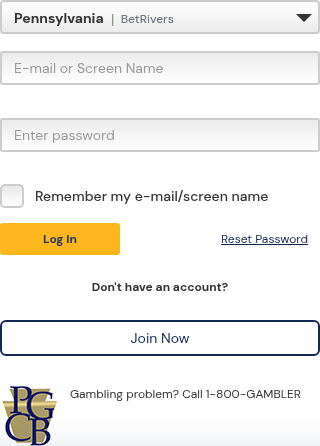
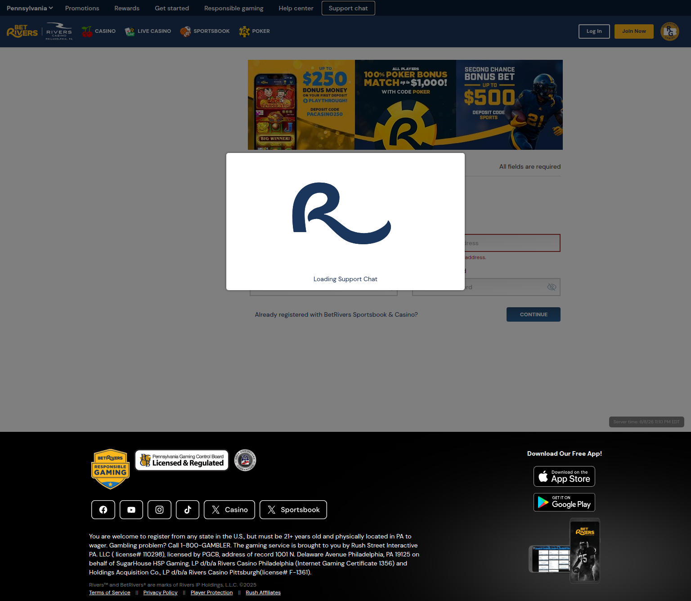
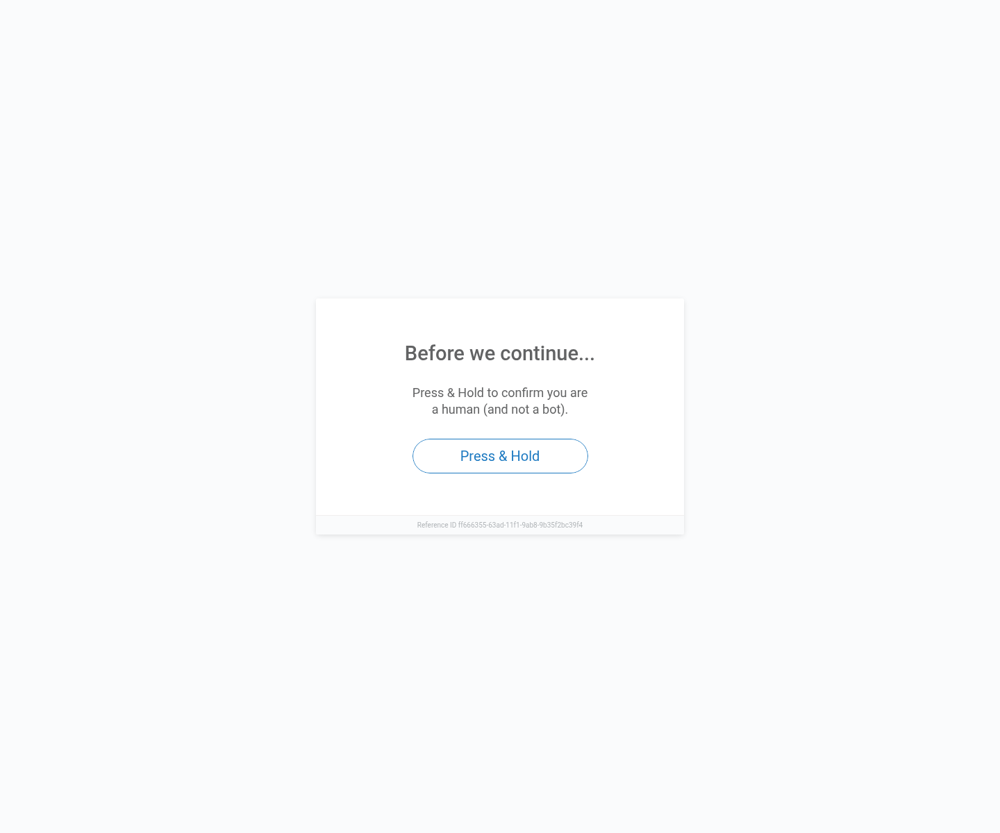
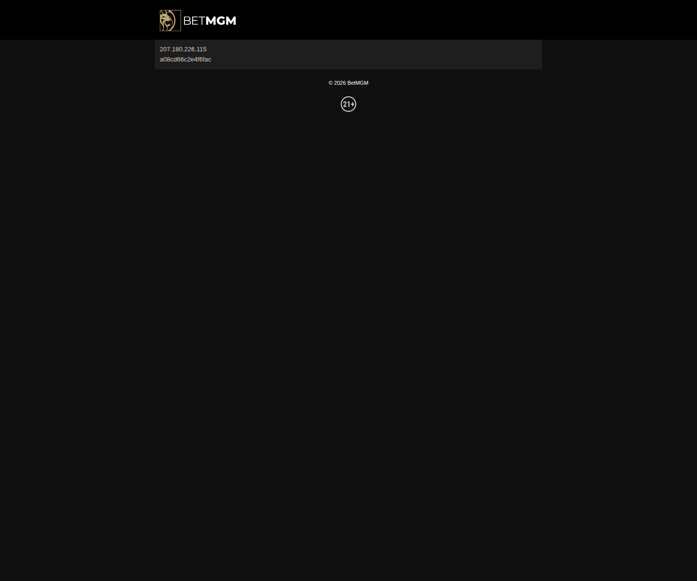

Meta Title  
Best US Online Casinos in 2026: Top Regulated Sites for Bonuses, Payout Speed, and Rewards

Meta Description  
Compare the best regulated US online casinos in 2026 based on bonuses, withdrawal guidance, rewards, game selection, and responsible gambling tools. See our top picks for DraftKings, Caesars Palace Online, BetRivers, FanDuel, and BetMGM.

Excerpt  
We reviewed official operator pages, support materials, rewards systems, and state availability information to compare the best regulated US online casinos in 2026. DraftKings leads this sample ranking for overall product depth, while Caesars Palace Online, BetRivers, FanDuel, and BetMGM each stand out for different player needs.

Slug  
best-us-online-casinos-2026

Primary Category  
Online Casinos

Secondary Category  
Casino Reviews

Suggested Tags  
best online casinos, US online casinos, casino reviews, DraftKings Casino, Caesars Palace Online, BetRivers Casino, FanDuel Casino, BetMGM Casino, regulated online casinos

Disclaimer  
This article is a source-led editorial sample focused on regulated US online casinos. We reviewed official operator pages, support materials, promotions, rewards information, and responsible gambling resources. We did not complete funded deposit and withdrawal tests for every operator in this sample, so any payout-speed references should be treated as operator-stated or market-specific guidance unless explicitly verified by first-hand testing. Online gambling laws vary by state, and you should only play where it is legal and only if you are of legal age. Gambling can be addictive. If you need help, use your state’s responsible gambling resources.

# Best US Online Casinos in 2026: Our Top Picks for Regulated Players

Reviewer: Thana Lamth  
Review Type: Source-led editorial review  
Last Updated: June 9, 2026  
Market Focus: Regulated United States online casinos  
What We Reviewed: Official casino product pages, rewards programs, support materials, responsible gambling tools, and state availability guidance

DraftKings Casino is our top overall pick in this sample because it combines strong game depth, a polished mainstream product, and clear regulated-market positioning. Caesars Palace Online ranks highly for rewards, BetRivers stands out for bonus usability, FanDuel is one of the clearest for player guidance, and BetMGM remains a strong loyalty-led option for mainstream US players.

## Why This Page Focuses Only on Regulated US Casinos

Many weak casino roundup pages make the same mistake: they mix legal US operators, offshore casinos, and crypto-first brands into a single ranking without explaining the tradeoffs. That may create a bigger list, but it creates a worse page for users.

This sample article is intentionally narrower. It focuses only on regulated US online casino brands that are publicly positioned for legal state markets. That gives the page a clearer user promise and makes the comparison more honest.

This means you will not see offshore or crypto-only casinos in this ranking, even if those brands are popular elsewhere. The goal here is not to produce the broadest list possible. The goal is to produce a cleaner and more trustworthy regulated-market comparison.

## How We Compared These Casinos

We evaluated each operator using the same editorial frame:

- State availability and market clarity
- Bonus structure and promo usability
- Rewards and retention value
- Payment and withdrawal guidance
- Game selection and live dealer depth
- Product polish and mobile usability
- Responsible gambling tools and trust signals

This sample draft is based on official operator content and public company materials. It is not a full hands-on deposit-and-withdrawal test for every brand. Where exact payment timing or cashier behavior has not been directly verified, that limitation is stated clearly.

## Quick Comparison Table

| Casino | Best For | Availability Signal | Bonus and Rewards Angle | Notes |
| --- | --- | --- | --- | --- |
| DraftKings Casino | Best overall | Connecticut, Michigan, New Jersey, Pennsylvania, West Virginia | Rotating promos, exclusive games, mainstream app strength | Best mix of product depth and broad user appeal |
| Caesars Palace Online Casino | Best rewards | Michigan, New Jersey, Pennsylvania, West Virginia, plus Ontario | Caesars Rewards integration | Best for players who value loyalty crossover |
| BetRivers Casino | Best bonus usability | State-specific regulated casino pages | Bonus Bank, Bonus Store, low-playthrough messaging | Strong utility-focused positioning |
| FanDuel Casino | Best for simplicity | Michigan, Pennsylvania, New Jersey, West Virginia, Connecticut | Clearer public bonus and withdrawal explanations | Best for lower-friction onboarding |
| BetMGM Casino | Best brand familiarity | Michigan, New Jersey, Pennsylvania, West Virginia | BetMGM Rewards, major brand trust | Strong mainstream loyalty play |

## Image Plan for This Article
The images used below are either public-page captures taken during this review session or live registration-flow captures where available. They should be described precisely based on what they show. Public pages are not the same as logged-in evidence, and support entry points are not the same as completed support conversations.

## 1. DraftKings Casino

Best overall regulated US online casino

Caption: Public DraftKings casino product page captured on June 9, 2026 during our review workflow. This supports product-positioning claims but is not a logged-in account screenshot.

DraftKings earns the top position in this sample because it presents the strongest all-around package for a regulated US player. Its public-facing materials are clear, its casino identity is well developed, and its product pitch is not limited to a generic list of slot games and promotions. Instead, DraftKings positions itself as a full-featured casino product with live dealer coverage, exclusives, and broad game depth.

That matters because the best overall pick in a casino roundup should not be chosen only for one isolated strength. It should be strong across multiple decision points. For many players, those decision points are not just bonus size or brand name. They also include usability, clarity, game variety, and confidence that the operator is truly built for the legal US market.

What we like

- DraftKings publicly positions its casino product as available in multiple regulated states, including Connecticut, Michigan, New Jersey, Pennsylvania, and West Virginia.
- Its product messaging emphasizes a large game library rather than only pushing one-time bonus messaging.
- Live dealer is positioned as part of the main product offering, not as a minor feature buried in the site.
- The brand has strong recognition among mainstream US bettors and casino users.
- Support and help materials are relatively easy to locate.

What holds it back

- Promotional offers can change frequently by month and by state, so claims about “best bonus” should always be checked locally before publishing.
- A promotion-heavy product environment may feel too busy for players who want a simpler casino-only experience.

Who it is best for

DraftKings is best for players who want the safest all-around recommendation in a regulated US roundup. It is particularly strong for people who value app polish, broad game choice, and a large-brand experience over niche features.

## 2. Caesars Palace Online Casino

Best for rewards and loyalty value

Caption: Public Caesars Palace Online support and onboarding page captured on June 9, 2026 during our review workflow. This is public-page evidence rather than cashier or logged-in proof.

Caesars Palace Online Casino ranks second because it has one of the clearest rewards-led value propositions in the category. While many brands talk about loyalty, Caesars has a more recognizable land-based and online bridge. For players who care about earning value within a larger gaming ecosystem, that matters.

This is one of the few brands where loyalty is not just a side feature. It is one of the main reasons to choose the operator. Recent public Caesars materials continue to push rewards integration and exclusive online features, which reinforces that this is a central part of the product, not an afterthought.

What we like

- Caesars clearly connects online casino activity to Caesars Rewards.
- The brand has strong name recognition among traditional casino audiences.
- Public support and onboarding materials are easy to find.
- The product is available in multiple regulated markets, including New Jersey, Pennsylvania, Michigan, and West Virginia.
- It has a more classic casino-brand identity than some newer app-first operators.

What holds it back

- Its strongest value depends on how much the player actually cares about rewards crossover.
- Offer language can vary by state, and the exact value of a welcome package should not be generalized without local verification.

Who it is best for

Caesars Palace Online is best for rewards-focused players, especially those who already know the Caesars brand or prefer a more traditional casino feel instead of a sportsbook-led app identity.

## 3. BetRivers Casino

Best for bonus usability and player-friendly utility

Caption: Public BetRivers casino landing page captured on June 9, 2026 during our review workflow. This supports public product and branding observations but is not a cashier or support capture.

Caption: BetRivers Join Now Step 1 captured on June 9, 2026 during our review workflow. Registration fields were redacted before publishing to avoid exposing personal data.

Caption: BetRivers signup Step 2 captured on June 9, 2026 during our review workflow. This confirms the account-creation flow proceeds into security questions, phone number, and last-four-SSN requirements.

Caption: BetRivers login form captured on June 9, 2026 during our review workflow. This provides a real pre-login account-access asset for the review package.

Caption: BetRivers support chat loading state captured on June 9, 2026 during our review workflow. This confirms access to the support-chat entry point, although a completed agent conversation still remains pending.

BetRivers stands out because it appears to think more carefully than most brands about how bonus value is actually experienced by players. Many casino operators market large offers, but the user experience around those offers is often vague, restrictive, or difficult to interpret. BetRivers makes a stronger case for practical value.

Its public materials repeatedly emphasize low-playthrough messaging, the Bonus Bank, the Bonus Store, and RUSHPAY. Even without a full cashier test, that creates a meaningful differentiation signal. It suggests that the operator understands that players care not just about what a bonus says on the banner, but how usable it feels inside the actual casino experience.

What we like

- Strong public messaging around low-playthrough bonus mechanics.
- Bonus Bank and Bonus Store create a clearer product story than the typical one-line promo banner.
- RUSHPAY is positioned as a practical player-facing withdrawal tool.
- The brand feels utility-led rather than purely promotional.
- State-specific landing pages help narrow the legal market scope.

What holds it back

- BetRivers has less mainstream consumer recognition than DraftKings, Caesars, or BetMGM.
- State-by-state variation means editorial claims must be tightly localized.
- A true logged-in cashier capture still remains pending because this workflow has not completed a verified account signup.

Who it is best for

BetRivers is best for players who are bonus-sensitive and want a clearer explanation of what they are actually getting. It is also strong for readers who care more about operational practicality than about brand prestige.

BetRivers evidence status at this stage:

- Public home page: captured
- Signup step 1 redacted: captured
- Signup step 2: captured
- Login form: captured
- Support-chat entry state: captured
- Logged-in cashier page: pending

## 4. FanDuel Casino

Best for simplicity and player guidance

Caption: Public FanDuel Casino 101 page captured on June 9, 2026 during our review workflow. This supports clarity and onboarding analysis but is not logged-in evidence.

FanDuel Casino performs well in this ranking because its public educational and onboarding materials are easier to understand than those of many competitors. That may sound like a small thing, but it matters more than many review pages acknowledge. Clear payment instructions, clearer responsible gambling language, and straightforward onboarding guidance reduce uncertainty for new or cautious users.

In a category filled with aggressive promo language, clarity can become a real competitive advantage. FanDuel’s public pages do a better job than most of explaining basic player actions in plain language.

What we like

- Public materials explain deposits, withdrawals, and bonus mechanics more clearly than most brands.
- Responsible gambling resources are easy to find.
- The legal-market footprint is clearly presented.
- The brand feels beginner-friendlier than some more complex casino products.

What holds it back

- Direct access checks using the proxy setup in our research workflow were incomplete for this brand.
- Some offer messaging is campaign-based and can change quickly.
- FanDuel may appeal less to users who want a more casino-first personality.

Who it is best for

FanDuel is best for users who want a simpler introduction to regulated online casino play, especially those who value straightforward guidance over feature-heavy presentation.

## 5. BetMGM Casino

Best for loyalty crossover and mainstream familiarity

Caption: Public BetMGM rewards page captured on June 9, 2026 during our review workflow. This supports rewards-related commentary but is not a logged-in or cashier screenshot.

BetMGM remains an important brand in any regulated US casino conversation because of its mainstream familiarity, strong legacy-brand association, and loyalty positioning. It is the kind of operator that many users will recognize before they compare any details, and that recognition still matters.

For some users, trust begins with familiarity. BetMGM benefits from that. It also continues to position rewards as a core differentiator, which helps it stay competitive in a market where welcome offers can blur together quickly.

What we like

- Strong mainstream brand familiarity
- Loyalty remains a major part of the value proposition
- Public materials acknowledge that bonus terms can differ by state, which is a healthier editorial signal than pretending the market is uniform
- BetMGM has an established place in the regulated US casino conversation

What holds it back

- Direct proxy-based access checks returned a challenge page in our workflow, so that specific session did not fully validate the browsing experience
- Some players may find the strongest reasons to choose BetMGM depend too much on brand comfort rather than product differentiation
- Offer value is heavily market-specific

Who it is best for

BetMGM is best for mainstream players who care about familiar branding and rewards crossover, especially those who already trust the broader MGM ecosystem.

## What This Ranking Does Better Than a Generic Casino List

A lot of top casino pages fail because they look like rankings but read like recycled promo copy. They often overstate certainty, mix incompatible markets, and pretend to have tested details they have not actually tested.

This sample avoids that by being explicit about what was reviewed and what remains unverified. That approach may look less flashy, but it creates a stronger editorial base.

This page improves on low-trust casino roundups in five ways:

- It limits scope to regulated US operators instead of mixing legal and offshore markets.
- It compares each brand against the same decision-making frame.
- It treats rewards, withdrawals, and usability as practical issues rather than only headline offers.
- It signals where evidence still needs to be collected.
- It places responsible gambling and legal scope inside the article, not just in the footer.

## Responsible Gambling and Legal Availability

You should only use online casinos where they are legal in your state and where you meet the legal age requirement. Online casino availability in the United States is not national. It is state-specific, and even well-known brands may only operate in a small set of markets.

A trustworthy casino review should not blur that line. It should also not present bonuses or gambling activity as risk-free. The better operators surface tools such as deposit limits, self-exclusion, cooling-off periods, and account controls. These tools are not decorative compliance elements. They are part of the product experience and should be discussed as such.

If you are writing or publishing casino content, this section should appear in the body of the article, not be hidden at the very end.

## Who This Ranking Is Best For

This list is best for:

- Users comparing legal US online casinos
- Readers who want a cleaner editorial comparison instead of a hype-driven list
- Players who care about rewards, usability, and payment guidance
- Writers building a regulated-market casino page with stronger trust signals

This list is not ideal for:

- Readers looking for offshore or crypto-only casinos
- Users who need exact live bonus verification in every state
- Players looking for a full first-hand cashout test from each operator

## FAQ

### What is the best US online casino in 2026?

In this sample ranking, DraftKings Casino is the best overall regulated US online casino because it presents the strongest balance of product depth, legal-market clarity, mainstream usability, and game variety. It is not automatically the best for every player, but it is the safest all-around editorial pick.

### Which online casino has the best rewards program?

Caesars Palace Online Casino stands out most clearly for rewards because its online experience is tightly connected to Caesars Rewards. BetMGM is also strong in this area, but Caesars has the cleaner loyalty-first identity in this sample comparison.

### Which casino looks best for bonus usability?

BetRivers looks strongest for bonus usability because its public product messaging goes beyond headline promo size and focuses more on how bonus value actually works inside the user experience. That makes it especially interesting for players who care about practical value.

### Is FanDuel Casino good for beginners?

FanDuel Casino is one of the better beginner-friendly options in this sample because its public deposit, withdrawal, and onboarding information is easier to understand than many competing brands. That clarity reduces friction for new users entering a regulated casino environment.

### Why is this article limited to regulated US casinos?

This article is limited to regulated US casinos because mixing legal US operators with offshore or crypto-first brands creates a weaker and less trustworthy comparison. A narrower scope improves editorial clarity and gives users a more honest answer to a more specific search intent.

### Were all payout speeds fully tested first hand?

No. This sample article is source-led and not a full funded deposit-and-withdrawal test across all brands. Where payout timing is referenced, it should be interpreted as market guidance, public operator positioning, or a placeholder for later hands-on verification.

## Final Verdict

If you need a clean regulated-US-only shortlist in 2026, DraftKings is the strongest overall pick, Caesars Palace Online is the best loyalty-led alternative, and BetRivers is the most interesting brand for players who care about bonus mechanics and withdrawal usability. FanDuel and BetMGM remain strong mainstream options, but they are slightly less compelling than the top three in this evidence-led sample.

The next step for turning this article from a strong sample into a stronger publish-ready asset is simple: add first-hand evidence. That means logged-in screenshots, cashier captures, support-chat evidence, device-specific captions, and state-specific offer verification. The structure is already strong. What remains is execution.
